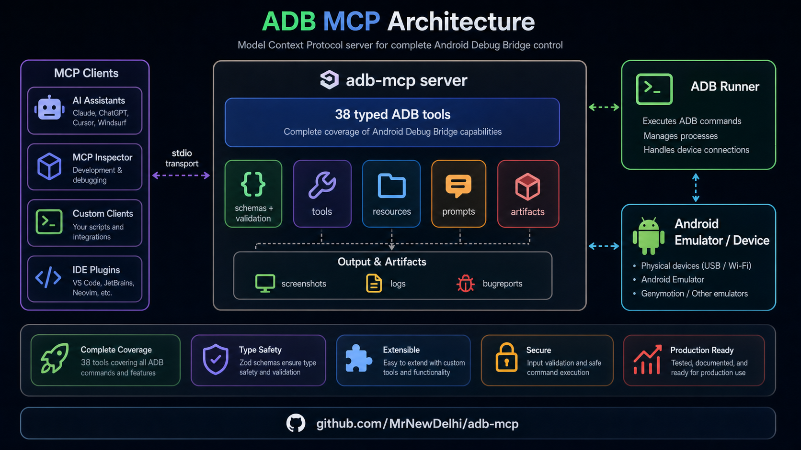

# adb-mcp Architecture



`adb-mcp` is organized around MCP primitives and ADB execution boundaries.

## Runtime Flow

```text
MCP client
  -> StdioServerTransport
  -> createServer()
  -> registerAdbTools()
  -> createAdbRunner()
  -> adb process
```

## Source Layout

- `src/index.ts`: executable stdio entrypoint.
- `src/server.ts`: creates the MCP server, instructions, and component registration.
- `src/adb.ts`: process runner and ADB runner factory.
- `src/schemas.ts`: shared Zod schemas for common tool inputs.
- `src/adbHelpers.ts`: ADB argument helpers, parsers, shell quoting, and output paths.
- `src/mcpResponses.ts`: MCP text response helpers.
- `src/tools/adbTools.ts`: ADB tool registration and handlers.
- `src/resources.ts`: MCP resources.
- `src/prompts.ts`: MCP prompts.
- `tests/mcp-smoke.mjs`: startup and capability registration smoke test.

## MCP Components

Tools are the main surface because ADB is action-oriented. Resources are used for read-only context such as cheatsheets. Prompts are used for repeatable workflows such as Android triage.

The server uses the current SDK registration methods:

- `registerTool`
- `registerResource`
- `registerPrompt`

## Security Boundary

The server intentionally keeps ADB execution in `src/adb.ts`. Tool handlers build argument arrays and call the runner. High-risk operations remain explicit in names and descriptions.

Do not add a network transport without authentication, host validation, CORS review, and DNS rebinding protection.

## Testing

Run:

```bash
npm run test
```

This performs:

- TypeScript checking
- MCP server build and smoke test
- Skill validation

Live Android verification still requires an emulator or device.
